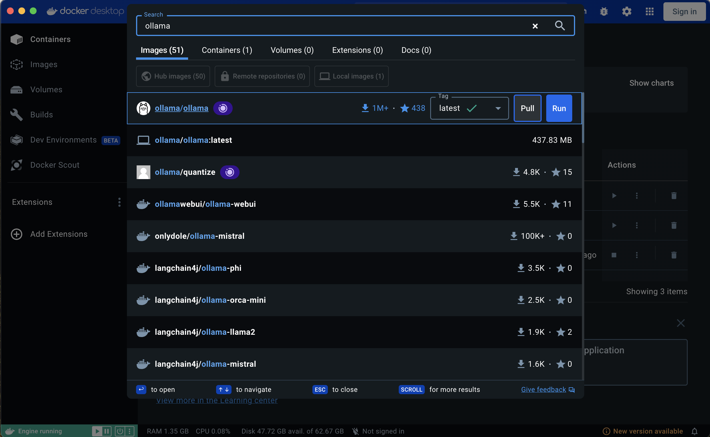
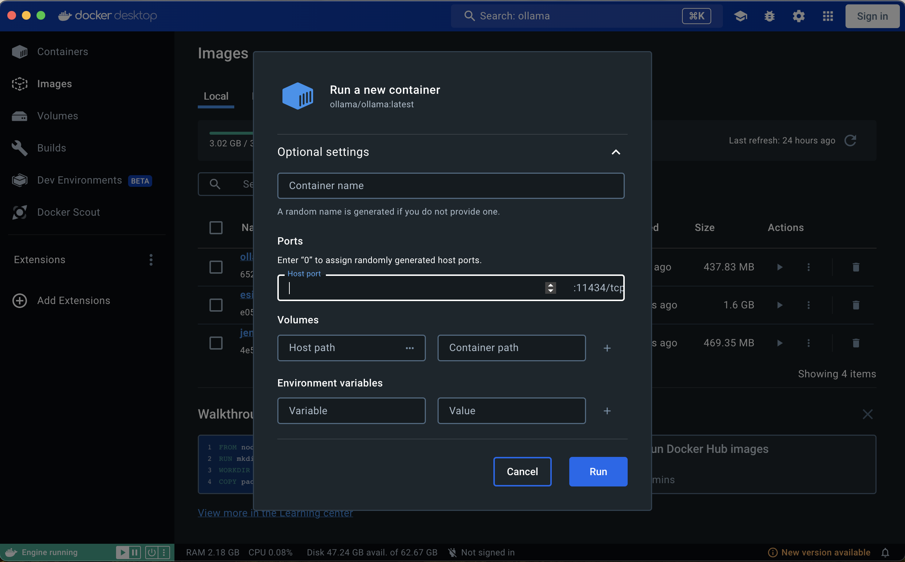
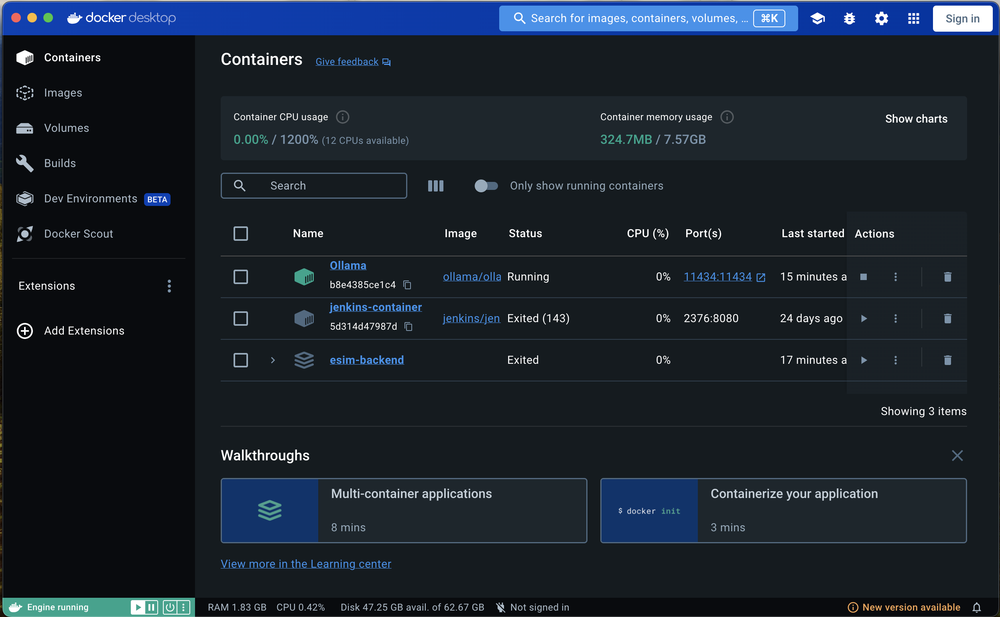
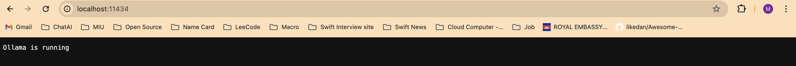
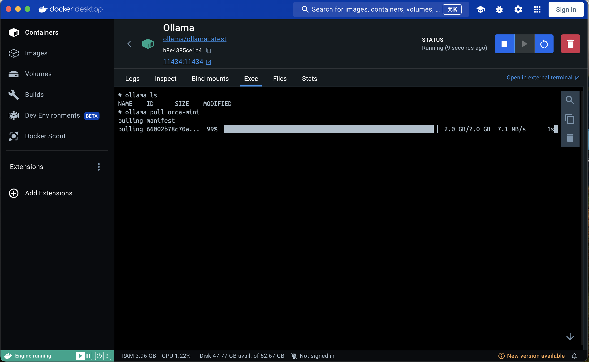
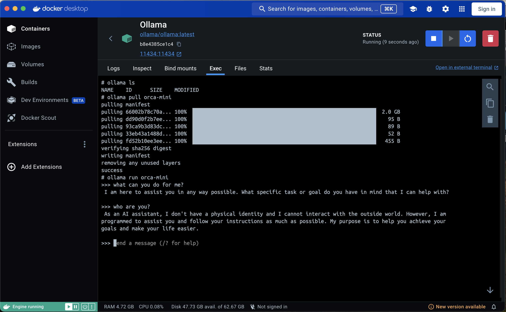

## Introduction
As increasing of artificial intelligence, Large Language Models (LLMs) stand at the forefront of innovation, revolutionizing the way machines understand and generate human-like text. There are a lot of models, such as GPT, Llama3, Phi...etc that top companies like Faang created and open-source those projects.

As for this post, I will guide you on how to simply run LLM on your computer with different models using an open-source project [Ollama](https://ollama.com/).

## Pre-requirement
You can install Ollama directly on your local or using Docker. I prefer docker more than local because it won't affect configure on my local and I can easily remove it. You will either need [Docker CLI or Docker Desktop](https://www.docker.com/) for this tutorial. I will use [Docker Desktop](https://www.docker.com/products/docker-desktop/) as it has a good UI and is easy to use. I don't need to remember or look for CLI.

I assume you already installed docker and know how to use it for this part.

## Step by Step Guide

#### STEP 1
Pull [Ollama](https://ollama.com/) Image

#### STEP 2
Create new container. You don't need to input those field. All fields are optional.
But I recommend to input some fields for good practice.

- Input container name (recommend)
- Input port, you can input defaul port 11434 (recommend)
- Map volumes and environment variables

#### STEP 3
Run Container

Once your container run, you can check in your localhost with port that you configure.

#### STEP 4
Download [models](https://ollama.com/library) that you want to run.
For me, I want to run [orca-min](https://ollama.com/library/orca-mini). It is small model and I think it is good for my old mac.

To download model, you need go to teminal of the container then use this commandline: `ollama pull 'mondel-name'`

To see the list of models downloaded in your Ollama's container use this commandline `ollama ls`

#### FINAL STEP
After downloaded the model, you run that model by commandline `ollama run 'model-name'`

Now you can test your own ChatGPT. It is not fast like the Nvidia GPU but it is testable. 

## Conclusion

You can run any models of LLM in your local in these 5 simple steps. It opens up new possibilities for developers, engineers to try with their idea. If you use docker CLI, it took you less then a minute to run model.

As for me, this is my first step in the journey of AI as a software engineer. Even though I am not a genius who creates AI, I think I can be someone who can use it for my purpose. For the next step, I am looking for a way how to train my data like pdf into models.
